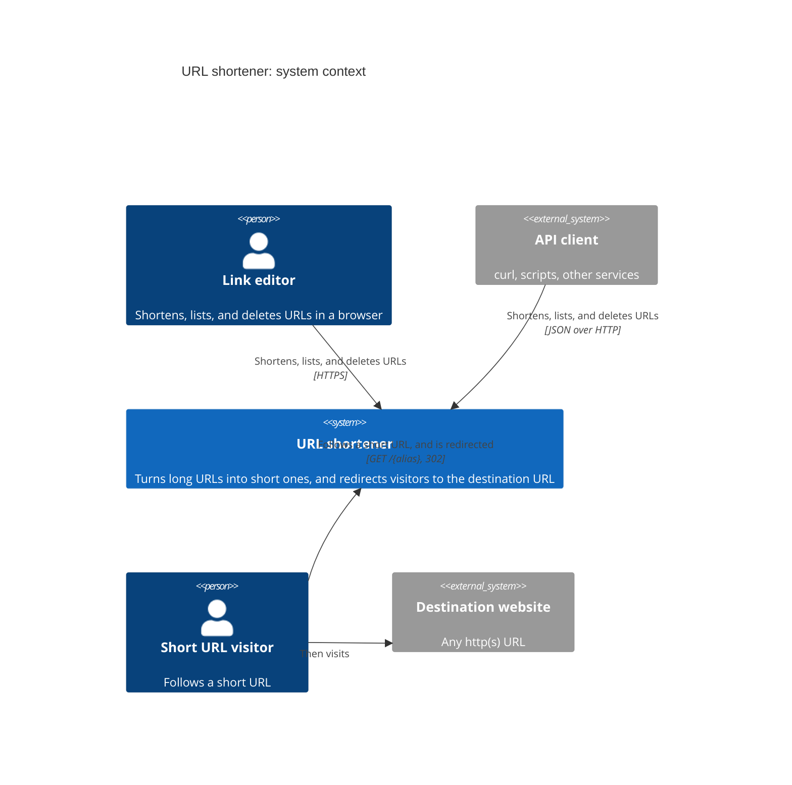

# Context diagram

```mermaid
C4Context
  title URL shortener: system context

  Person(creator, "Link editor", "Shortens, lists, and deletes URLs in a browser")
  System_Ext(client, "API client", "curl, scripts, other services")
  System(shortener, "URL shortener", "Turns long URLs into short ones, and redirects visitors to the destination URL")
  Person(visitor, "Short URL visitor", "Follows a short URL")
  System_Ext(target, "Destination website", "Any http(s) URL")

  Rel(creator, shortener, "Shortens, lists, and deletes URLs", "HTTPS")
  Rel(client, shortener, "Shortens, lists, and deletes URLs", "JSON over HTTP")
  Rel(visitor, shortener, "Follows a short URL, and is redirected", "GET /{alias}, 302")
  Rel(visitor, target, "Then visits")

  UpdateRelStyle(creator, shortener, $offsetX="-110", $offsetY="-10")
  UpdateRelStyle(client, shortener, $offsetX="10", $offsetY="-40")
  UpdateRelStyle(visitor, shortener, $offsetX="-20", $offsetY="-110")
  UpdateRelStyle(visitor, target, $offsetX="-60", $offsetY="10")

  UpdateLayoutConfig($c4ShapeInRow="2", $c4BoundaryInRow="1")
```
