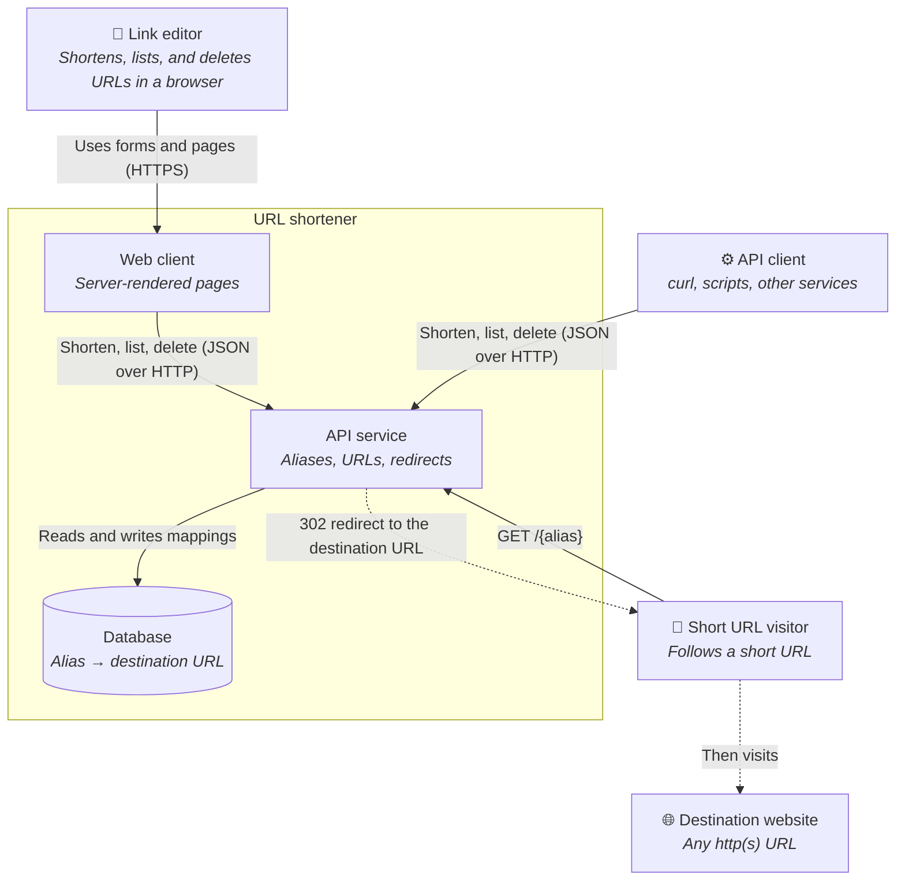

# Context diagram

```mermaid
flowchart TB
  creator["👤 Link editor<br/><i>Shortens, lists, and deletes URLs in a browser</i>"]
  client["⚙️ API client<br/><i>curl, scripts, other services</i>"]
  visitor["👤 Short URL visitor<br/><i>Follows a short URL</i>"]

  subgraph system["URL shortener"]
    web["Web client<br/><i>Server-rendered pages</i>"]
    api["API service<br/><i>Aliases, URLs, redirects</i>"]
    db[("Database<br/><i>Alias → destination URL</i>")]
  end

  target["🌐 Destination website<br/><i>Any http(s) URL</i>"]

  creator -- "Uses forms and pages (HTTPS)" --> web
  web -- "Shorten, list, delete (JSON over HTTP)" --> api
  client -- "Shorten, list, delete (JSON over HTTP)" --> api
  visitor -- "GET /{alias}" --> api
  api -- "Reads and writes mappings" --> db
  api -. "302 redirect to the destination URL" .-> visitor
  visitor -. "Then visits" .-> target
```

