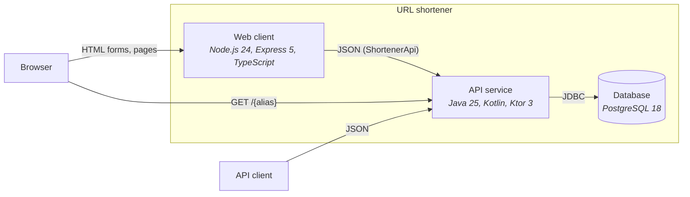

# Containers

The system has three containers (in the C4 sense): the **web client**, the
**API service**, and the **database**. Each container is built and deployed
independently.

```mermaid
flowchart LR
  browser["Browser"]
  subgraph system["URL shortener"]
    web["Web client<br/><i>Node.js 24, Express 5, TypeScript</i>"]
    api["API service<br/><i>Java 25, Kotlin, Ktor 3</i>"]
    db[("Database<br/><i>PostgreSQL 18</i>")]
  end
  apiclient["API client"]

  browser -- "HTML forms, pages" --> web
  browser -- "GET /{alias}" --> api
  apiclient -- "JSON" --> api
  web -- "JSON (ShortenerApi)" --> api
  api -- "JDBC" --> db
```
