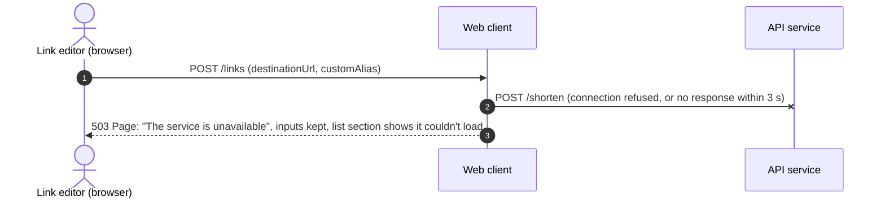

# S6: The API service is unavailable

```mermaid
sequenceDiagram
  autonumber
  actor C as Link editor (browser)
  participant W as Web client
  participant A as API service

  C->>W: POST /links (destinationUrl, customAlias)
  W-xA: POST /shorten (connection refused, or no response within 3 s)
  W-->>C: 503 Page: "The service is unavailable", inputs kept, list section shows it couldn't load
```

`GET /` behaves the same way when `GET /urls` fails: the form still renders,
and the list area explains that links couldn't be loaded.
