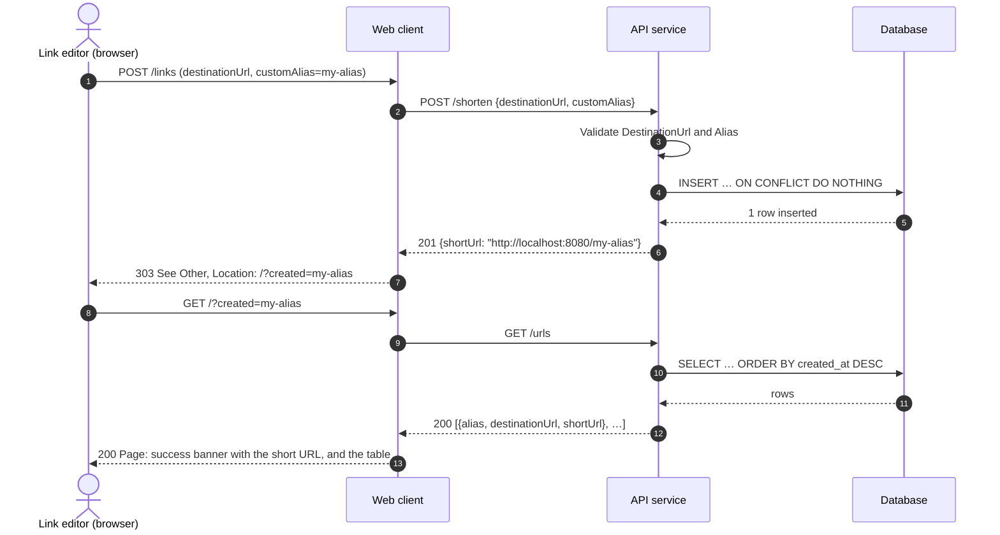

# S1: Shorten a URL with a custom alias, in the browser

```mermaid
sequenceDiagram
  autonumber
  actor C as Link editor (browser)
  participant W as Web client
  participant A as API service
  participant D as Database

  C->>W: POST /links (destinationUrl, customAlias=my-alias)
  W->>A: POST /shorten {destinationUrl, customAlias}
  A->>A: Validate DestinationUrl and Alias
  A->>D: INSERT … ON CONFLICT DO NOTHING
  D-->>A: 1 row inserted
  A-->>W: 201 {shortUrl: "http://localhost:8080/my-alias"}
  W-->>C: 303 See Other, Location: /?created=my-alias
  C->>W: GET /?created=my-alias
  W->>A: GET /urls
  A->>D: SELECT … ORDER BY created_at DESC
  D-->>A: rows
  A-->>W: 200 [{alias, destinationUrl, shortUrl}, …]
  W-->>C: 200 Page: success banner with the short URL, and the table
```
